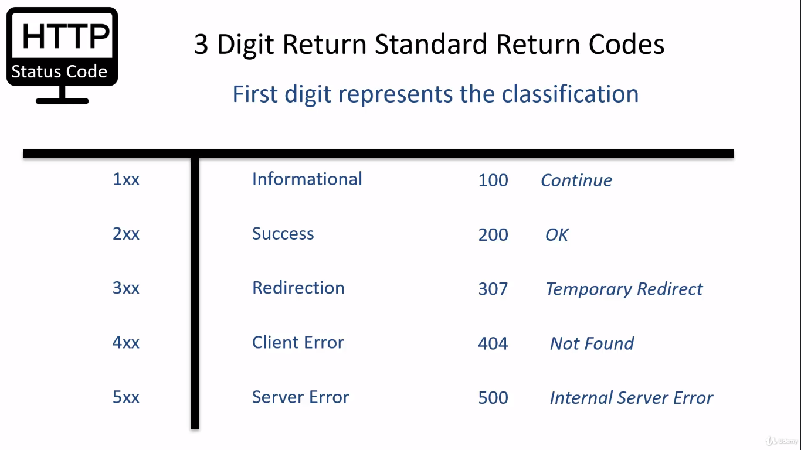
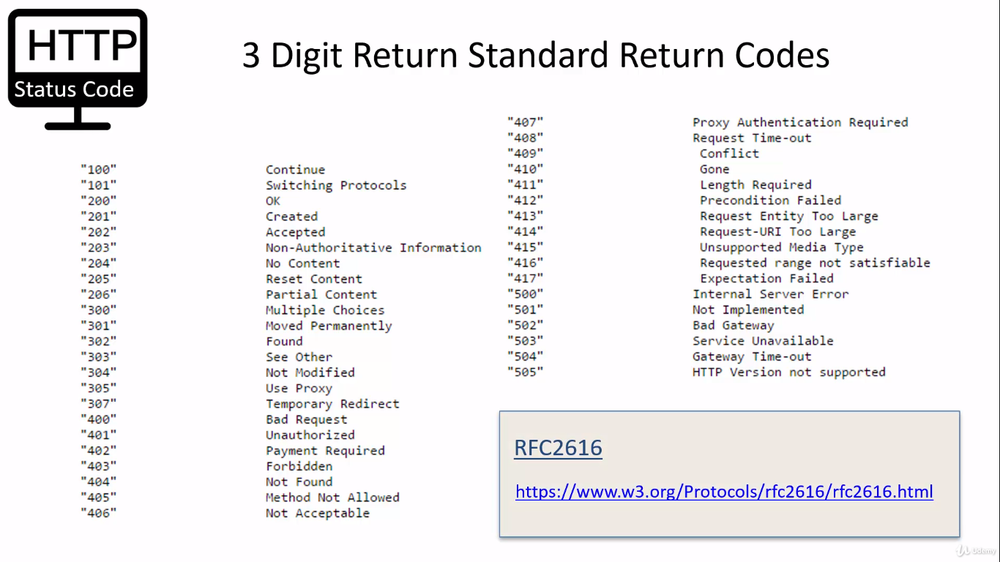
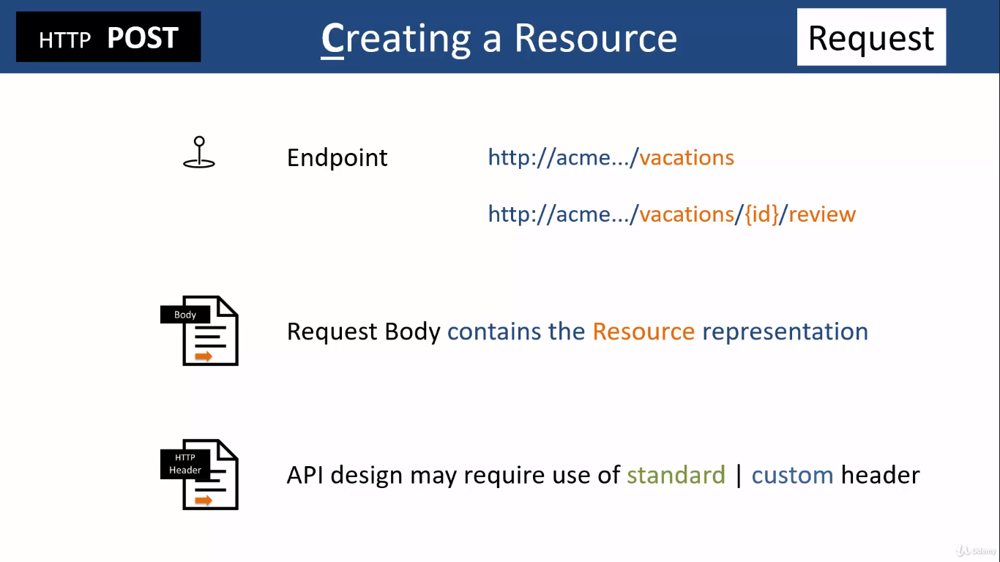
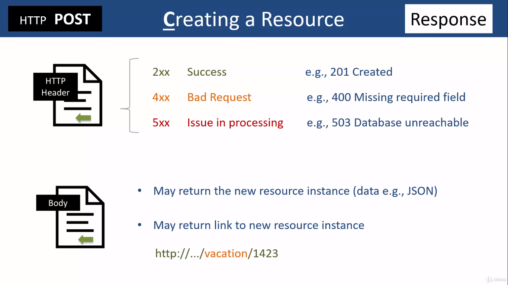
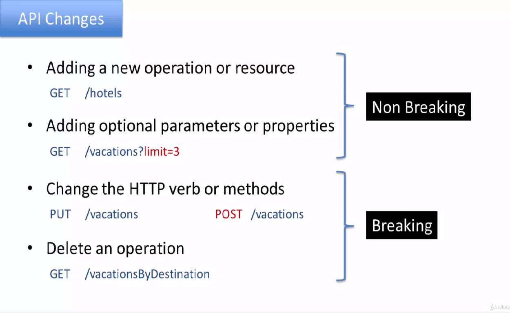
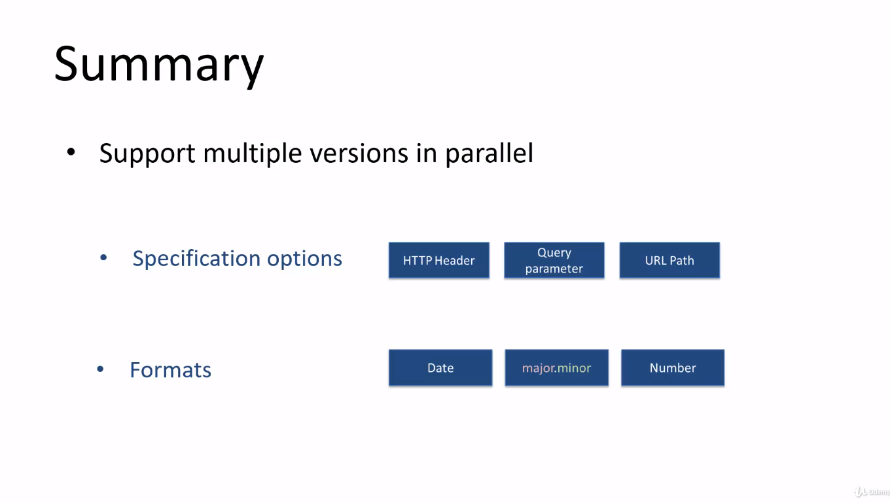
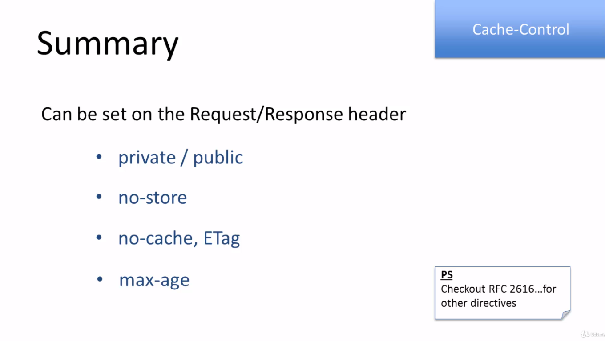

# REST API Learning Materials

## Status Codes

### First Digit Represents the classification

### Commonly Used Status Codes

### Link to Learn More About Status Codes: [Link](https://developer.mozilla.org/en-US/docs/Web/HTTP/Status)

## Implementing CRUD Operations

### POST Request

### POST Response

### Updating Options (PUT/PATCH)

### PUT/PATCH Request

### PUT/PATCH Response

### GET Request

### GET Response

### DELETE Request

### DELETE Response

## Handling API Changes

## Versioning the API

## HTTP Protocol Specifications: [Link](https://www.w3.org/Protocols/rfc2616/rfc2616.html)

## Cache Control Directives

## API Caching using Cache-Control Directives: [Link](./rest-api-caching/)

## Implementation o Partial Response Support

- ### Switch to branch 'partialresponse' to view code: [Link](https://github.com/sujal7/rest-api/tree/partialresponse)

- ### Gives API Consumer in control of response.
- ### It is used to send different response to the app developer/client based on the query parameter of fields. It is useful to send response back to different devices like mobile, tablet, desktop etc.

## Implementing Pagination

### - API Consumer in control of response.

### - Asks for Number of rows needed

### 1. Using Cursor for Pagination

### 2. Offset based Pagination (Commonly used)

### 3. HTTP Link Header

## Switch to branch pagination for its implementation: [Link](https://github.com/sujal7/rest-api/tree/pagination)
